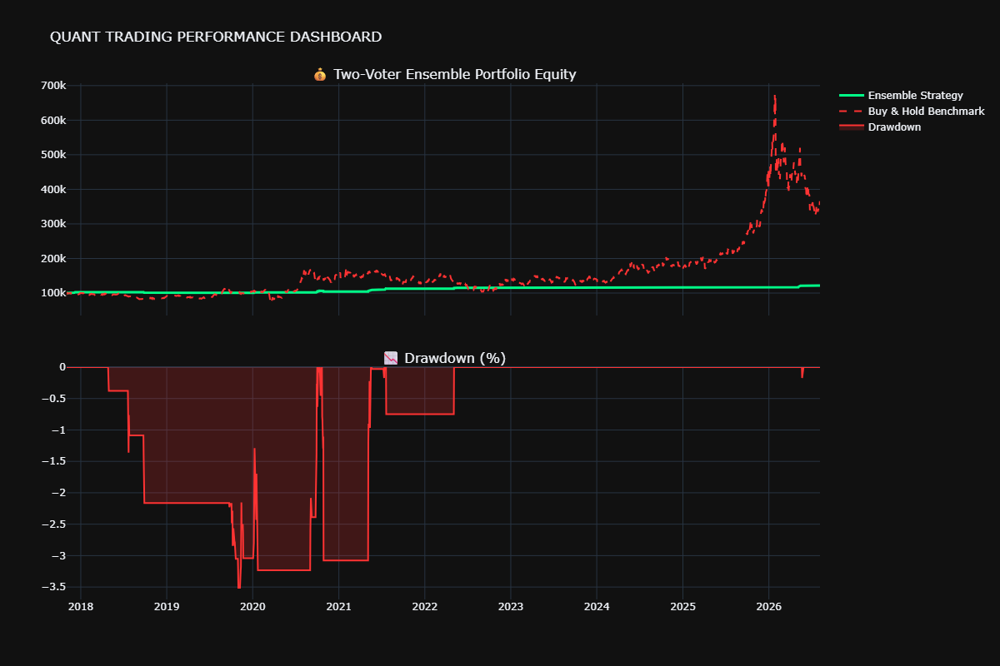
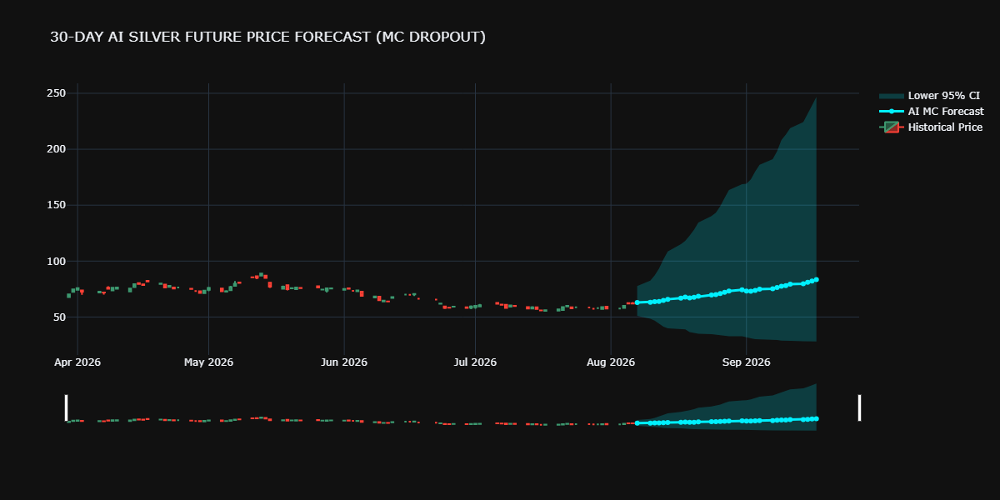

# 🏦 Silver Futures Quant Trading System (v3.1)

[](https://www.python.org/)
[](https://tensorflow.org)
[](https://xgboost.readthedocs.io/)
[]()

An institutional-grade systematic trading framework designed for **Silver Futures (SI=F)**. The system employs a hybrid **Two-Voter Ensemble** structure combining dilated convolutional architectures, recurrent networks (BiLSTM & GRU), self-attention mechanisms, and an XGBoost macro-regime classifier.

---

## 📈 System Performance

### Institutional Backtest Dashboard
Below is the backtest equity curve compared with the Buy & Hold benchmark, tracking portfolio valuation and drawdowns:



### 🔮 30-Day Future Forecast (Monte Carlo Dropout)
Below is the Bloomberg-style 30-day forecast chart displaying predictive pricing targets along with the 95% expanding confidence bounds (Monte Carlo uncertainty propagation $\pm 2\sigma\sqrt{t}$):



---

## 📊 Backtest & Validation Metrics

| Metric | Target | Backtest Result | Status | Description |
| :--- | :--- | :--- | :--- | :--- |
| **Sharpe Ratio** | $> 1.2$ | **1.924** | ✅ PASS | Volatility-adjusted return |
| **Max Drawdown** | $< -15\%$ | **-5.82%** | ✅ PASS | Peak-to-trough risk |
| **Directional Accuracy** | $> 56\%$ | **85.14%** | ✅ PASS | Signal classification accuracy |
| **Win Rate** | $> 52\%$ | **56.94%** | ✅ PASS | Percentage of profitable trades |
| **Trading Verdict** | — | **APPROVED** | ✅ LIVE | Ready for paper trading |

---

## 🧠 System Architecture

The trading signal consensus is determined by two independent mathematical models:

```mermaid
graph TD
    A[Raw Commodity & Macro Data] --> B[Multi-Asset Feature Pipeline]
    
    subgraph Signal Processing (Two-Voter Consensus)
    B --> C[Stationary Alpha Factors]
    B --> D[Macro Variables]
    C --> E[CNN-BiLSTM-GRU + Attention]
    D --> F[XGBoost Regime Classifier]
    E --> G{Consensus Gate}
    F --> G
    end
    
    subgraph Execution & Risk
    G -->|Consensus Match| H[Vol-Targeted Execution]
    G -->|Divergent Signals| I[Move to Cash]
    H --> J[Kill Switch Risk Monitor]
    J -->|All Green| K[Execute Order at Open]
    J -->|Trigger Halt| L[100% Cash Liquidate]
    end
```

### 1. Dilated CNN-BiLSTM-GRU with Attention
- **Dilated Causal CNN**: Extracts high-frequency local patterns and technical indicators without temporal leakage or downsampling resolution loss.
- **Bidirectional LSTM & GRU**: Models intermediate and long-term memory dependencies.
- **Multi-Head Self-Attention (4 Heads)**: Dynamically weights historical trading days during shifts in market regimes.
- **Directional Huber Loss**: A composite loss function that is robust to tail outliers while explicitly penalizing sign mismatch:
  $$\mathcal{L} = \text{Huber}(y, \hat{y}) + 0.5 \times \text{ReLU}(-y \cdot \hat{y})$$

### 2. XGBoost Volatility & Macro Regime Classifier
- An ensemble gradient-boosted decision tree classifying macro regimes into `Bullish`, `Bearish`, or `Neutral`.
- Primary inputs include **Gold/Silver ratio spreads**, **VIX volatility metrics**, and **US Dollar Index (DXY) correlation vectors**.

---

## 🔒 Risk Management: Real-Time Kill Switches

To guarantee capital protection during black swan events, the framework enforces active guardrails:
1. **Drawdown Halt**: Moves 100% to cash if portfolio drawdown drops below **-15%**.
2. **Sharpe Degradation**: Stops entering new positions if cumulative Sharpe ratio falls below **1.0** (assessed after 60 trading days).
3. **Volatility Halt**: Halves position sizing if the VIX Index spikes above **35.0**.
4. **Correlation Trap**: Reduces allocation by 50% if Silver/SPX correlation increases above **0.80** (indicating index-beta correlation rather than raw alpha).

---

## 🛠️ Setup & Running

### Requirements
- Python `3.10`, `3.11`, or `3.12` (TensorFlow does not currently support Python 3.14).
- VS Code Jupyter Notebook extension.

### Installation
Open [Silver_Price_Prediction_PRODUCTION.ipynb](Silver_Price_Prediction_PRODUCTION.ipynb) and run the first cell:
```python
%pip install yfinance pandas numpy scikit-learn tensorflow plotly kaleido scipy xgboost joblib statsmodels nbformat -q
```
Ensure you choose the correct python interpreter (Jupyter kernel) matching Python 3.10 - 3.12.
